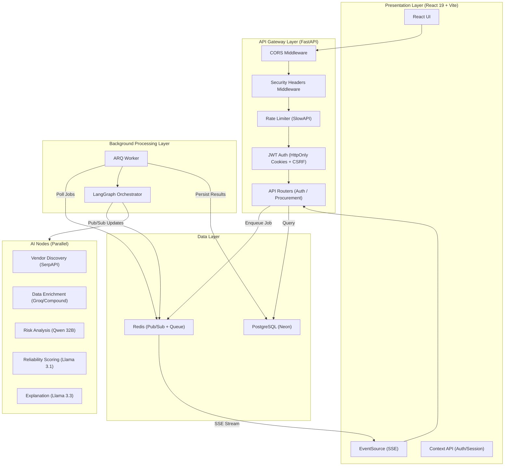
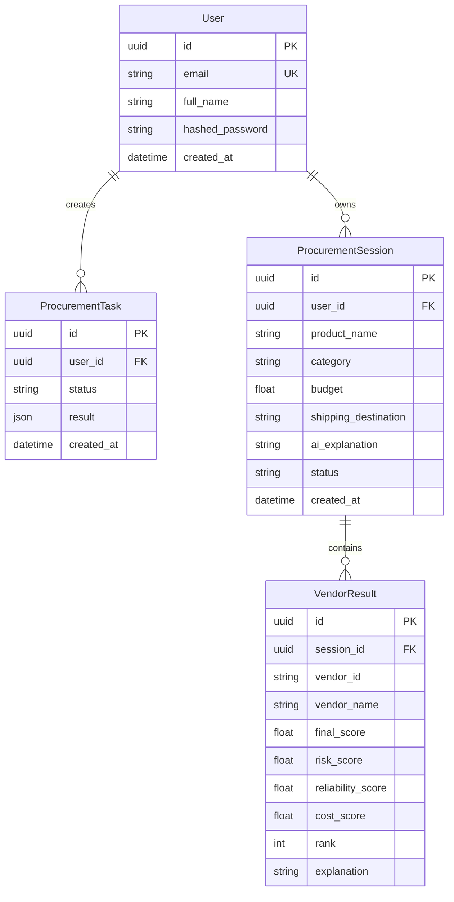

# 🏗 SpendOS Architecture & System Design

This document details the internal architecture of SpendOS, outlining how it achieves high-throughput AI inference and real-time state synchronization.

---

## 📐 High-Level Architecture Diagram

---

## 🏛 System Layers

SpendOS is designed as a **decoupled asynchronous platform** consisting of four primary layers:

### 1. Presentation Layer (React 19)
- **State Management**: Uses React Context API (`AuthContext`, `SessionContext`) for global state.
- **Real-time Updates**: Subscribes to Server-Sent Events (SSE) from the backend to track background task progress.
- **Styling**: Modern, responsive Glassmorphism UI built with Vanilla CSS.

### 2. API Gateway Layer (FastAPI)
- **Role**: Handles HTTP requests, authentication (JWT/HttpOnly Cookies), and task dispatching.
- **Security**: Implements Double-Submit CSRF protection for state-changing operations.
- **Task Ingestion**: Instead of running AI pipelines in the request cycle, the API enqueues jobs to Redis (via ARQ) and returns a `task_id` immediately.

### 3. Background Processing Layer (ARQ + Redis)
- **Role**: A dedicated worker process that pulls jobs from Redis.
- **Scalability**: Can be horizontally scaled by running multiple worker instances.
- **Lifecycle**: Updates the PostgreSQL database as it transitions through `pending` -> `processing` -> `completed`/`failed`.

### 4. AI Orchestration Layer (LangGraph)
- **Engine**: LangGraph manages the state of a multi-node workflow.
- **Workflow Steps**:
  1. **Discovery Node**: Uses SerpAPI for live web searching.
  2. **Enrichment Node**: Synthesizes search snippets into structured vendor profiles.
  3. **Risk/Reliability Nodes**: Parallelized scoring using `asyncio.gather` for near-instant analysis across all discovered vendors.
  4. **Explanation Node**: Generates the final executive summary for the user.
- **Load Balancing**: Distributes token usage across multiple models (Llama 3.3, Qwen 32B, Llama 3.1) to achieve a combined **94,000 TPM** throughput.

---

## 🔄 The Data Flow Lifecycle

1.  **User Request**: Prompt -> Frontend -> FastAPI.
2.  **Dispatch**: FastAPI enqueues `run_procurement_task` to Redis and returns `202 Accepted`.
3.  **Worker Pick-up**: ARQ worker picks up the job and initializes the LangGraph.
4.  **AI Pipeline**: LangGraph executes nodes, communicating progress via Redis Pub/Sub.
5.  **SSE Streaming**: Frontend listens to Redis Pub/Sub and updates the UI in real-time.
6.  **Completion**: Result is persisted to PostgreSQL and the task is marked as `completed`.
7.  **Export**: User downloads the finalized report as a CSV.

---

## 🗄️ Database Schema

SpendOS uses **PostgreSQL** (hosted on Neon) with the following core entities:

---

## 🔒 Security Architecture

SpendOS implements a multi-layered defense strategy:

| Layer | Mechanism | Implementation |
|---|---|---|
| **Authentication** | JWT in HttpOnly cookies | `app/auth.py` — bcrypt password hashing, access + refresh tokens |
| **CSRF Protection** | Double-Submit Cookie pattern | CSRF token in cookie + `X-CSRF-Token` header validation |
| **Rate Limiting** | SlowAPI (per-user / per-IP) | `app/middleware/rate_limit.py` — 30 req/min default |
| **Security Headers** | OWASP best practices | `app/middleware/security_headers.py` — HSTS, X-Frame-Options, CSP |
| **Input Validation** | Pydantic schemas | All request payloads validated with strict types and constraints |
| **SQL Injection** | SQLAlchemy ORM | Parameterized queries throughout, no raw SQL |
| **Authorization** | User-scoped data access | All queries filtered by `user_id` from JWT claims |

---

## ⚡ Performance Optimizations

- **Pydantic Validation**: All LLM outputs are strictly validated against Pydantic schemas.
- **Hybrid Load Balancing**: High-throughput models (Groq/Compound) handle bulk data, while versatile models (Llama 3.3) handle complex reasoning.
- **Regex Extraction**: Custom sanitization prevents "Heuristic Fallbacks" by robustly isolating JSON from chatty LLM outputs.
- **Procurement Caching**: Identical requests are deduplicated using SHA-256 hashing to avoid redundant AI pipeline executions.
- **Connection Pooling**: SQLAlchemy async engine with `pool_size=20` and `pool_pre_ping=True` for resilient database connections.

